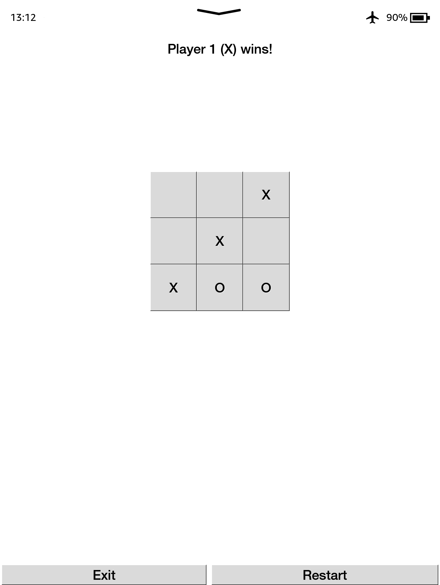

# TicTacToe Kindle
TicTacToe game written in C++ & GTK 2.0 for Amazon Kindle PW4+



## Install

- Install [WinterBreak JB](https://kindlemodding.org/jailbreaking/WinterBreak/)
- Install [KUAL](https://kindlemodding.org/jailbreaking/post-jailbreak/installing-kual-mrpi/)
- Download the game from the [latest releases](https://github.com/progzone122/tictactoe-kindle/releases)
- Unzip the archive and move the tictactoe directory to extensions on kindle
- Run the game (KUAL -> TicTacToe)

## Build

- Install linux :)
- Install [C++ toolchain and SDK](https://kindlemodding.org/kindle-dev/gtk-tutorial/prerequisites.html)
- Configure the path for the SDK in the ```build_kindlehf.sh``` script
- Run the script to build
  - ```build_pc.sh```: Make a build for pc and run it
  - ```build_kindlehf.sh```: Make a build for Kindle